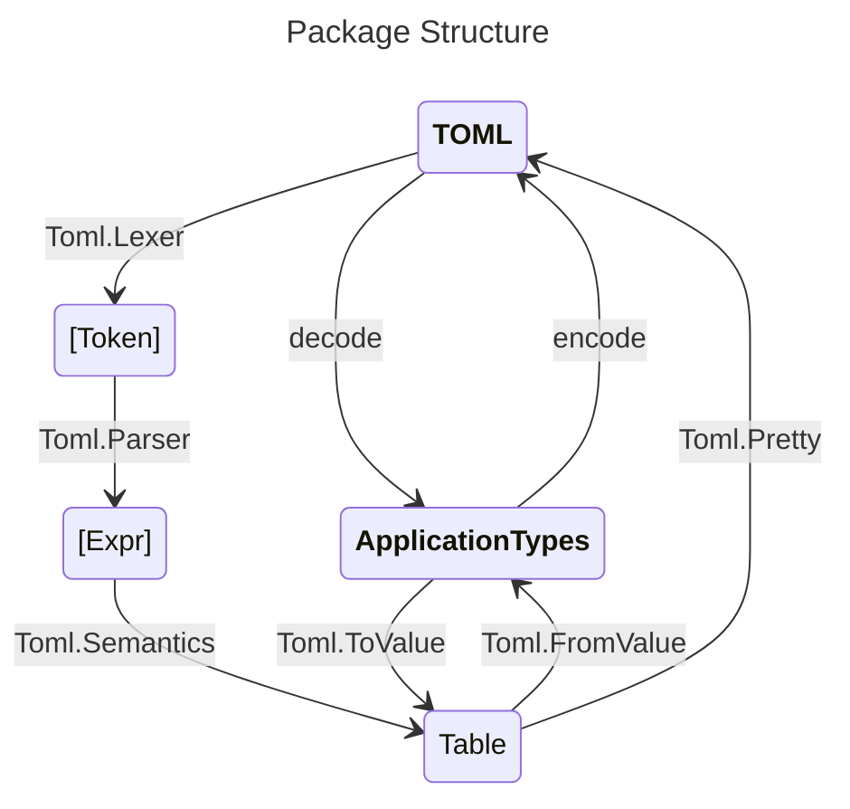

# TOML Parser

This package implements a validating parser for [TOML 1.0.0](https://toml.io/en/v1.0.0).

This package uses an [alex](https://haskell-alex.readthedocs.io/en/latest/)-generated
lexer and [happy](https://haskell-happy.readthedocs.io/en/latest/)-generated parser.

It also provides a pair of classes for serializing into and out of TOML.

## Package Structure



The highest-level interface to this package is to define `FromValue` and `ToTable`
instances for your application-specific datatypes. These can be used with `encode`
and `decode` to convert to and from TOML.

For low-level access to the TOML format, the lexer, parser, and validator are available
for direct use. The diagram above shows how the different modules enable you to
advance through the increasingly high-level TOML representations.

## Examples

This file uses [markdown-unlit](https://hackage.haskell.org/package/markdown-unlit)
to ensure that its code typechecks and stays in sync with the rest of the package.

```haskell
import GHC.Generics (Generic)
import QuoteStr (quoteStr)
import Test.Hspec (Spec, hspec, it, shouldBe)
import Toml (parse, decode, encode, Value(..))
import Toml.FromValue (Result(Success), FromValue(fromValue), parseTableFromValue, reqKey)
import Toml.Generic (GenericToml(..))
import Toml.ToValue (ToValue(toValue), ToTable(toTable), defaultTableToValue, table, (.=))

main :: IO ()
main = hspec (parses >> decodes >> encodes)
```

### Using the raw parser

Consider this sample TOML text from the TOML specification.

```haskell
fruitStr :: String
fruitStr = [quoteStr|
```

```toml
[[fruits]]
name = "apple"

[fruits.physical]  # subtable
color = "red"
shape = "round"

[[fruits.varieties]]  # nested array of tables
name = "red delicious"

[[fruits.varieties]]
name = "granny smith"


[[fruits]]
name = "banana"

[[fruits.varieties]]
name = "plantain"
```

```haskell
|]
```

Parsing using this package generates the following value

```haskell
parses :: Spec
parses = it "parses" $
    parse fruitStr
    `shouldBe`
    Right (table [
        ("fruits", Array [
            Table (table [
                ("name", String "apple"),
                ("physical", Table (table [
                    ("color", String "red"),
                    ("shape", String "round")])),
                ("varieties", Array [
                    Table (table [("name", String "red delicious")]),
                    Table (table [("name", String "granny smith")])])]),
            Table (table [
                ("name", String "banana"),
                ("varieties", Array [
                    Table (table [("name", String "plantain")])])])])])
```

### Using decoding classes

Here's an example of defining datatypes and deserializers for the TOML above.
The `FromValue` typeclass is used to encode each datatype into a TOML value.
Instances can be derived for simple record types. More complex examples can
be manually derived.

```haskell
newtype Fruits = Fruits { fruits :: [Fruit] }
    deriving (Eq, Show, Generic)
    deriving FromValue via GenericToml Fruits
    deriving ToValue   via GenericToml Fruits
    deriving ToTable   via GenericToml Fruits

data Fruit = Fruit { name :: String, physical :: Maybe Physical, varieties :: [Variety] }
    deriving (Eq, Show, Generic)
    deriving FromValue via GenericToml Fruit
    deriving ToValue   via GenericToml Fruit
    deriving ToTable   via GenericToml Fruit

data Physical = Physical { color :: String, shape :: String }
    deriving (Eq, Show)

newtype Variety = Variety String
    deriving (Eq, Show)

instance FromValue Physical where
    fromValue = parseTableFromValue (Physical <$> reqKey "color" <*> reqKey "shape")

instance FromValue Variety where
    fromValue = parseTableFromValue (Variety <$> reqKey "name")
```

We can run this example on the original value to deserialize it into domain-specific datatypes.

```haskell
decodes :: Spec
decodes = it "decodes" $
    decode fruitStr
    `shouldBe`
    Success [] (Fruits [
        Fruit
            "apple"
            (Just (Physical "red" "round"))
            [Variety "red delicious", Variety "granny smith"],
        Fruit "banana" Nothing [Variety "plantain"]])
```

### Using encoding classes

The `ToValue` class is for all datatypes that can be encoded into TOML.
The more specialized `ToTable` class is for datatypes that encode into
tables and are thus elligible to be top-level types (all TOML documents
are tables at the top-level).

Generics can be used to derive `ToTable` for simple record types.
Manually defined instances are available for the more complex cases.

```haskell
instance ToValue Physical where toValue = defaultTableToValue
instance ToTable Physical where toTable x = table ["color" .= color x, "shape" .= shape x]
instance ToValue Variety  where toValue = defaultTableToValue
instance ToTable Variety  where toTable (Variety x) = table ["name" .= x]

encodes :: Spec
encodes = it "encodes" $
    show (encode (Fruits [Fruit
            "apple"
            (Just (Physical "red" "round"))
            [Variety "red delicious", Variety "granny smith"]]))
    `shouldBe` [quoteStr|
        [[fruits]]
        name = "apple"

        [fruits.physical]
        color = "red"
        shape = "round"

        [[fruits.varieties]]
        name = "red delicious"

        [[fruits.varieties]]
        name = "granny smith"|]
```

## More Examples

A demonstration of using this package at a more realistic scale
can be found in [HieDemoSpec](test/HieDemoSpec.hs). The various unit
test files demonstrate what you can do with this library and what
outputs you can expect.

See the low-level operations used to build a TOML syntax highlighter
in [TomlHighlighter](test-drivers/highlighter/Main.hs).
