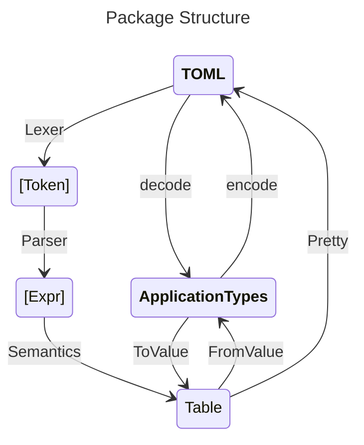

# TOML Parser

This package implements a validating parser for [TOML 1.1.0](https://toml.io/en/v1.1.0).

This package uses an [alex](https://haskell-alex.readthedocs.io/en/latest/)-generated
lexer and [happy](https://haskell-happy.readthedocs.io/en/latest/)-generated parser.

It also provides a pair of classes for serializing into and out of TOML.

## Package Structure



Most users will only need to import **Toml** or **Toml.Schema**. Other top-level
modules are for low-level hacking on the TOML format itself. All modules below
these top-level modules are exposed to provide direct access to library implementation
details.

- **Toml** - Basic encoding and decoding TOML
- **Toml.Schema** - TOML schemas for application types
- **Toml.Semantics** - Low-level semantic operations on TOML syntax
- **Toml.Syntax** - Low-level parsing of text into TOML raw syntax

## Examples

This file uses [markdown-unlit](https://hackage.haskell.org/package/markdown-unlit)
to ensure that its code typechecks and stays in sync with the rest of the package.

```haskell
{-# Language OverloadedStrings #-}
import Data.Text (Text)
import GHC.Generics (Generic)
import QuoteStr (quoteStr)
import Test.Hspec (Spec, hspec, it, shouldBe)
import Toml
import Toml.Schema

main :: IO ()
main = hspec (parses >> decodes >> encodes >> warns >> errors)
```

### Using the raw parser

Consider this sample TOML text from the TOML specification.

```haskell
fruitStr :: Text
fruitStr = [quoteStr|
```

```toml
[[fruits]]
name = "apple"

[fruits.physical]  # subtable
color = "red"
shape = "round"

[[fruits.varieties]]  # nested array of tables
name = "red delicious"

[[fruits.varieties]]
name = "granny smith"


[[fruits]]
name = "banana"

[[fruits.varieties]]
name = "plantain"
```

```haskell
|]
```

Parsing using this package generates the following unstructured value

```haskell
parses :: Spec
parses = it "parses" $
    forgetTableAnns <$> parse fruitStr
    `shouldBe`
    Right (table [
        ("fruits", List [
            Table (table [
                ("name", Text "apple"),
                ("physical", Table (table [
                    ("color", Text "red"),
                    ("shape", Text "round")])),
                ("varieties", List [
                    Table (table [("name", Text "red delicious")]),
                    Table (table [("name", Text "granny smith")])])]),
            Table (table [
                ("name", Text "banana"),
                ("varieties", List [
                    Table (table [("name", Text "plantain")])])])])])
```

### Defining a schema

We can define a schema for our TOML format in the form of instances of
`FromValue`, `ToValue`, and `ToTable` in order to read TOML directly
into structured data form. This example manually derives some of the
instances as a demonstration.

```haskell
newtype Fruits = Fruits { fruits :: [Fruit] }
    deriving (Eq, Show, Generic)
    deriving (ToTable, ToValue, FromValue) via GenericTomlTable Fruits

data Fruit = Fruit { name :: String, physical :: Maybe Physical, varieties :: [Variety] }
    deriving (Eq, Show, Generic)
    deriving (ToTable, ToValue, FromValue) via GenericTomlTable Fruit

data Physical = Physical { color :: String, shape :: String }
    deriving (Eq, Show, Generic)
    deriving (ToTable, ToValue, FromValue) via GenericTomlTable Physical

newtype Variety = Variety String
    deriving (Eq, Show)

instance FromValue Variety where
    fromValue = parseTableFromValue (Variety <$> reqKey "name")
instance ToValue Variety where
    toValue = defaultTableToValue
instance ToTable Variety where
    toTable (Variety x) = table ["name" .= x]

```

We can run this example on the original value to deserialize it into domain-specific datatypes.

```haskell
decodes :: Spec
decodes = it "decodes" $
    decode fruitStr
    `shouldBe`
    Success [] (Fruits [
        Fruit
            "apple"
            (Just (Physical "red" "round"))
            [Variety "red delicious", Variety "granny smith"],
        Fruit "banana" Nothing [Variety "plantain"]])

encodes :: Spec
encodes = it "encodes" $
    show (encode (Fruits [Fruit
            "apple"
            (Just (Physical "red" "round"))
            [Variety "red delicious", Variety "granny smith"]]))
    `shouldBe` [quoteStr|
        [[fruits]]
        name = "apple"

        [fruits.physical]
        color = "red"
        shape = "round"

        [[fruits.varieties]]
        name = "red delicious"

        [[fruits.varieties]]
        name = "granny smith"|]
```

### Useful errors and warnings

This package takes care to preserve source information as much as possible
in order to provide useful feedback to users. These examples show a couple
of the message that can be generated when things don't go perfectly.

```haskell
warns :: Spec
warns = it "warns" $
    decode [quoteStr|
        name = "simulated"
        typo = 10|]
    `shouldBe`
    Success
        ["2:1: unexpected key: typo in <top-level>"] -- warnings
        (Variety "simulated")

errors :: Spec
errors = it "errors" $
    decode [quoteStr|
        # Physical characteristics table
        color = "blue"
        shape = []|]
    `shouldBe`
    (Failure
        ["3:9: expected string but got array in shape"]
        :: Result String Physical)
```

## More Examples

A demonstration of using this package at a more realistic scale
can be found in [HieDemoSpec](test/HieDemoSpec.hs). The various unit
test files demonstrate what you can do with this library and what
outputs you can expect.

See the low-level operations used to build a TOML syntax highlighter
in [TomlHighlighter](test-drivers/highlighter/Main.hs).
